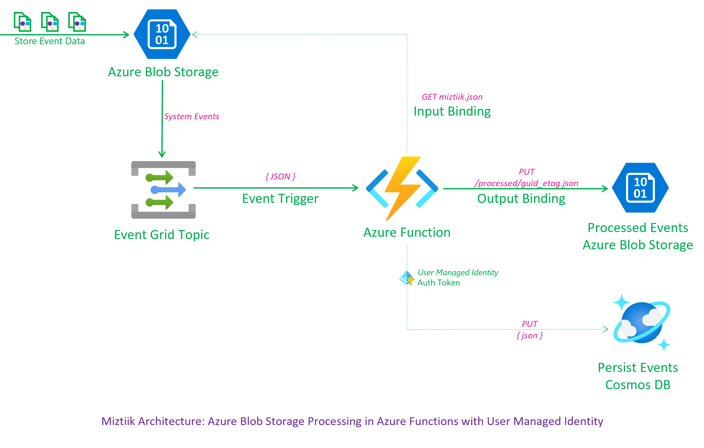
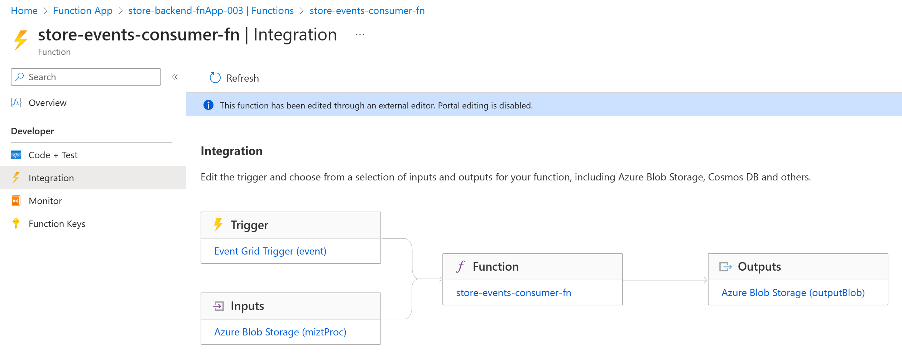
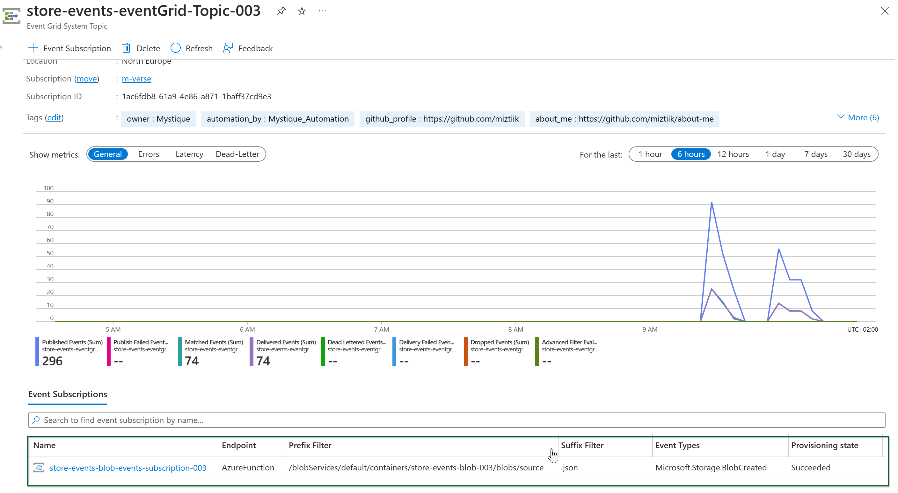
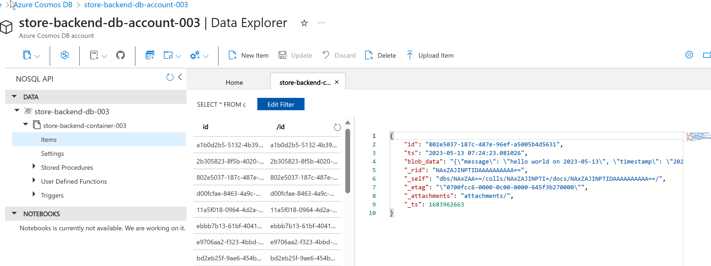

# Azure Blob Storage Processing with Event Grid Triggers & Python Azure Functions using Managed Identity

The developers at Mystique Unicorn [process files][6] as soon [as they arrive][7]. They are currently using the Azure system managed identity. They are looking to scope the permissions of the function execution environment to the bare minimum.

They heard about Azure's capabilities for user managed identities. Can you help them implement this event processing at Mystique Unicorn? 



## 🎯 Solution

Azure offers user [assigned managed identities][8] that can be narrowly scoped to necessary permissions. But there are few nitty gritty things that we need to remember when using user managed identities.

- [User managed identities and resource mapping are cached][9] - The update interval is `24`hrs. Excerpt from docs,

   > The back-end services for managed identities maintain a cache per resource URI for around 24 hours. If you update the access policy of a particular target resource and immediately retrieve a token for that resource, you may continue to get a cached token with outdated permissions until that token expires. There's currently no way to force a token refresh.

   It is possible you may get errors due to this. My testing didn't show any errors, but it is possible. 

- The permission scoping for resources like cosmosdb data plane is slightlly different from say Storage Accounts. We need to use the `Microsoft.DocumentDB/databaseAccounts/sqlRoleDefinitions` to assign the permissions. The `Microsoft.DocumentDB/databaseAccounts/sqlRoleAssignments` is used to assign the role to the user managed identity.

- The Azure function needs these environment variables for permissions like cosmos DB to work, [Thanks to this blog][10]
   - `SUBSCRIPTION_ID`
   - `RESOURCE_GROUP`

With this knowledge, we can process Blob Storage through the use of Azure Functions and [Event Grid triggers][1] with user managed identity. The Azure [blob storage events][2] for events like blob creation and deletion can be used to trigger the function. A sample event from event grid is shown below,

```json
{
  "id": "538fcf9f-3..-1024-801417067d3a",
  "data": {
    "api": "PutBlob",
    "clientRequestId": "c0c0f290-ec..0bc9ef3b",
    "requestId": "538fcf9f-3..01417000000",
    "eTag": "0x8DB4E3BA4F8E488",
    "contentType": "application/json",
    "contentLength": 40,
    "blobType": "BlockBlob",
    "url": "https://warehouse6p5crf002.blob.core.windows.net/store-events-blob-002/source/7031_2023-05-06_event.json",
    "sequencer": "0000000000000000000000.000005276ba",
    "storageDiagnostics": { "batchId": "2901e730-b..-80d271000000" }
  },
  "topic": null,
  "subject": "/blobServices/default/containers/store-events-blob-002/blobs/source/7031_2023-05-06_event.json",
  "event_type": null
}
```
We can use this event as a trigger, retrieve the corresponding blob mentioned in `data.url` using the [input binding][3] and persist the processed event back to Blob Storage using the [output binding][4] and cosmos DB. _Although we can use a output binding for cosmos, we will use the python sdk to demonstrate the use of managed identity._

By leveraging the power of Bicep, all necessary resources can be easily provisioned and managed with minimal effort. Our solution uses Python for efficient event processing, allowing for quick and easy deployment of sophisticated event processing pipelines.

1. ## 🧰 Prerequisites

   This demo, instructions, scripts and bicep template is designed to be run in `westeurope`. With few or no modifications you can try it out in other regions as well(_Not covered here_).

   - 🛠 Azure CLI Installed & Configured - [Get help here](https://learn.microsoft.com/en-us/cli/azure/install-azure-cli)
   - 🛠 Bicep Installed & Configured - [Get help here](https://learn.microsoft.com/en-us/azure/azure-resource-manager/bicep/install)
   - 🛠 VS Code & Bicep Extenstions - [Get help here](https://learn.microsoft.com/en-us/azure/azure-resource-manager/bicep/install#vs-code-and-bicep-extension)

1. ## ⚙️ Setting up the environment

   - Get the application code

     ```bash
     https://github.com/miztiik/azure-blob-trigger-function-user-identity
     cd azure-blob-trigger-function-user-identity
     ```

1. ## 🚀 Prepare the environment

   Let check you have Azure Cli working with 

    ```bash
      # You should have azure cli preinstalled
      az account show
    ```

    You should see an output like this,

   ```json
    {
      "environmentName": "AzureCloud",
      "homeTenantId": "16b30820b6d3",
      "id": "1ac6fdbff37cd9e3",
      "isDefault": true,
      "managedByTenants": [],
      "name": "YOUR-SUBS-NAME",
      "state": "Enabled",
      "tenantId": "16b30820b6d3",
      "user": {
        "name": "miztiik@",
        "type": "user"
      }
    }
   ```

1. ## 🚀 Deploying the application

   - **Stack: Main Bicep**
     This will create the following resoureces
     - General purpose Storage Account
        - This will be used by Azure functions to store the function code
     - Storage Account with blob container
        - This will be used to store the events
     - Event Grid Topic
        - This will be used to trigger the Azure Function.
        - Create a subscription to the topic, that [filters][5] for `Microsoft.Storage.BlobCreated` events specific to the blob container.
     - Managed Identity
        - This will be used by the Azure Function to access the Cosmos DB
     - Python Azure Function
        - Input, Trigger, Output Binding to the blob container for events
     - Cosmos DB
        - This will be used to store the processed events

      ```bash
      # make deploy
      sh deployment_scripts/deploy.sh
      ```

      After successfully deploying the stack, Check the `Resource Groups/Deployments` section for the resources.

      
      

1. ## 🔬 Testing the solution

   - **Upload file(s) to blob**

      Get the storage account and container name from the output of the deployment. Upload a file to the container and check the logs of the function app to see the event processing in action.

      Sample bash script to upload files to blob container. You can also upload manually from the portal,
      ```bash
      # Set variables
      LOG_FILE="/var/log/miztiik-$(date +'%Y-%m-%d').json"
      COMPUTER_NAME=$(hostname)
      SLEEP_AT_WORK_SECS=0
      LOG_COUNT=2

      GREEN="\e[32m"
      CYAN="\e[36m"
      YELLOW="\e[33m"
      RESET="\e[0m"

      RESOURCE_GROUP="Miztiik_Enterprises_azure_blob_eventgrid_trigger_function_003"
      LOCATION="northeurope"
      SA_NAME="warehouseenx5vm003"
      CONTAINER_NAME="store-events-blob-003"
      

      for ((i=1; i<=LOG_COUNT; i++))
      do
      FILE_NAME_PREFIX=$(openssl rand -hex 4)
      FILE_NAME="${RANDOM}_$(date +'%Y-%m-%d')_event.json"
      echo -n "{\"message\": \"hello world on $(date +'%Y-%m-%d')\" , \"timestamp\": \"$(date -u +"%Y-%m-%dT%H:%M:%SZ")\"}" > ${FILE_NAME} 
      UPLOAD_STATUS=$(az storage blob upload \
        --account-name ${SA_NAME} \
        --container-name ${CONTAINER_NAME} \
        --name "source/${FILE_NAME}" \
        --file ${FILE_NAME} \
        --no-progress \
        --auth-mode login\
        --output json | tr -d '\r')
      
      sleep 2
      # echo -e ${GREEN}${UPLOAD_STATUS}${RESET}
      echo -e "\n  ${YELLOW}($i/$LOG_COUNT)${RESET} Blob: ${GREEN}${FILE_NAME}${RESET} uploaded to container: ${CYAN}${CONTAINER_NAME}${RESET} in storage account: ${CYAN}${SA_NAME}${RESET}"
      done
      ```
      You should see an output like this,
      >(1/2) Blob: 758_2023-05-13_event.json uploaded to container: store-events-blob-003 in storage account: warehouseenx5vm003

      >(2/2) Blob: 7893_2023-05-13_event.json uploaded to container: store-events-blob-003 in storage account: warehouseenx5vm003
       
      

      

     
1. ## 📒 Conclusion

    Here we have demonstrated how to use Azure functions to process blob files and persist in cosmosDB.
  

1. ## 🧹 CleanUp

If you want to destroy all the resources created by the stack, Execute the below command to delete the stack, or _you can delete the stack from console as well_

- Resources created during [Deploying The Application](#-deploying-the-application)
- _Any other custom resources, you have created for this demo_

```bash
# Delete from resource group
az group delete --name Miztiik_Enterprises_xxx --yes
# Follow any on-screen prompt
```

This is not an exhaustive list, please carry out other necessary steps as maybe applicable to your needs.

## 📌 Who is using this

This repository aims to show how to Bicep to new developers, Solution Architects & Ops Engineers in Azure.


### 💡 Help/Suggestions or 🐛 Bugs

Thank you for your interest in contributing to our project. Whether it is a bug report, new feature, correction, or additional documentation or solutions, we greatly value feedback and contributions from our community. [Start here](/issues)

### 👋 Buy me a coffee

[](https://ko-fi.com/Q5Q41QDGK) Buy me a [coffee ☕][900].

### 📚 References


1. [Azure Event Grid trigger for Azure Functions][1]
1. [Blob Storage events][2]
1. [Azure Blob Storage Input Binding][3]
1. [Azure Blob Storage Ouput Binding][4]
1. [Azure Event Grid Filters][5]
1. [Miztiik Blog - Blob Storage Event Processing with Python Azure Functions][6]
1. [Miztiik Blog - Blob Storage Processing with Python Azure Functions with HTTP Triggers][7]
1. [Azure Docs - Managed Identity][8]
1. [Azure Docs - Managed Identity Caching][9]
1. [Azure Docs - Azure Function and User Assigned Managed Identities][10]


[1]: https://learn.microsoft.com/en-us/azure/azure-functions/functions-bindings-event-grid-trigger?tabs=in-process%2Cextensionv3&pivots=programming-language-python
[2]: https://learn.microsoft.com/en-us/azure/event-grid/event-schema-blob-storage?tabs=event-grid-event-schema#blob-storage-events
[3]: https://learn.microsoft.com/en-us/azure/azure-functions/functions-bindings-storage-blob-input?tabs=python-v1
[4]: https://learn.microsoft.com/en-us/azure/azure-functions/functions-bindings-storage-blob-output?tabs=python-v1
[5]: https://learn.microsoft.com/en-us/azure/storage/blobs/storage-blob-event-overview
[6]: https://github.com/miztiik/azure-blob-trigger-python-function
[7]: https://github.com/miztiik/azure-blob-input-binding-to-function
[8]: https://learn.microsoft.com/en-us/azure/active-directory/managed-identities-azure-resources/overview
[9]: https://learn.microsoft.com/en-us/azure/app-service/overview-managed-identity?tabs=portal%2Chttp#configure-target-resource
[10]: https://www.red-gate.com/simple-talk/cloud/azure/azure-function-and-user-assigned-managed-identities/

### 🏷️ Metadata


**Level**: 200


[100]: https://www.udemy.com/course/aws-cloud-security/?referralCode=B7F1B6C78B45ADAF77A9
[101]: https://www.udemy.com/course/aws-cloud-security-proactive-way/?referralCode=71DC542AD4481309A441
[102]: https://www.udemy.com/course/aws-cloud-development-kit-from-beginner-to-professional/?referralCode=E15D7FB64E417C547579
[103]: https://www.udemy.com/course/aws-cloudformation-basics?referralCode=93AD3B1530BC871093D6
[899]: https://www.udemy.com/user/n-kumar/
[900]: https://ko-fi.com/miztiik
[901]: https://ko-fi.com/Q5Q41QDGK