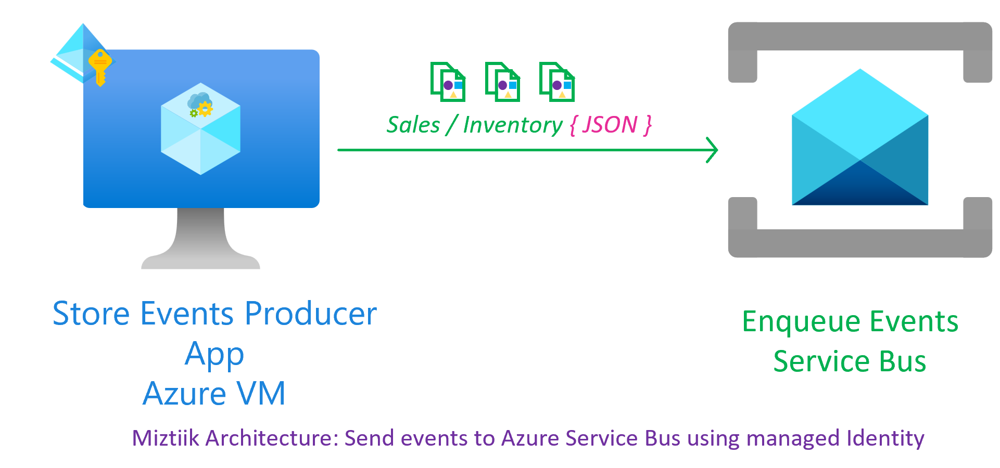
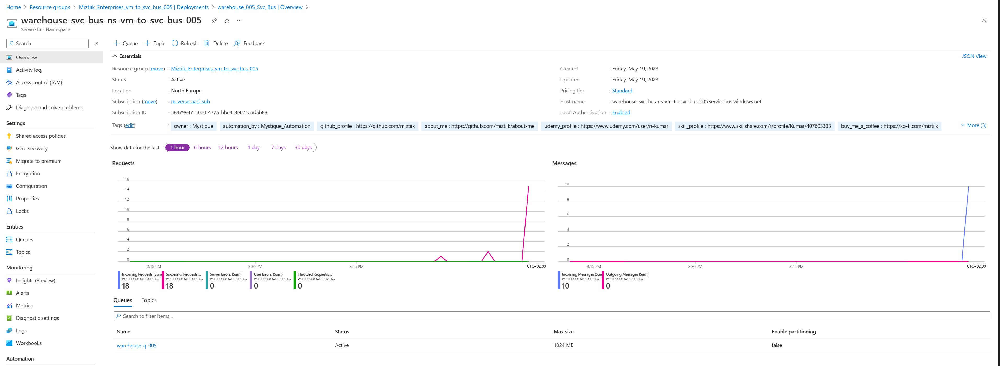
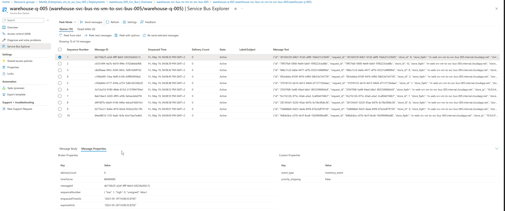

# Orchestrating Events with Azure Service Bus and Azure VMs using Managed Identity

Mystique Unicorn's developers are seeking assistance in implementing event processing for orchestrating events across multiple applications and services using Azure's native capabilities. Can you provide guidance on how to accomplish this?

## 🎯 Solution

We can leverage Azure Service Bus and the Python SDK for orchestrating events. Azure Service Bus provides a reliable messaging platform for event orchestration. In this demo, a VM with a managed identity will produce events and send them to a queue within a specific service bus namespace. The managed identity is exclusively scoped to this service bus namespace.



By leveraging the power of Bicep, all necessary resources can be easily provisioned and managed with minimal effort. Our solution uses Python for efficient event processing, allowing for quick and easy deployment of sophisticated event processing pipelines.

1. ## 🧰 Prerequisites

   This demo, instructions, scripts and bicep template is designed to be run in `westeurope`. With few or no modifications you can try it out in other regions as well(_Not covered here_).

   - 🛠 Azure CLI Installed & Configured - [Get help here](https://learn.microsoft.com/en-us/cli/azure/install-azure-cli)
   - 🛠 Bicep Installed & Configured - [Get help here](https://learn.microsoft.com/en-us/azure/azure-resource-manager/bicep/install)
   - 🛠 VS Code & Bicep Extenstions - [Get help here](https://learn.microsoft.com/en-us/azure/azure-resource-manager/bicep/install#vs-code-and-bicep-extension)

1. ## ⚙️ Setting up the environment

   - Get the application code

     ```bash
     https://github.com/miztiik/azure-vm-to-svc-bus
     cd azure-vm-to-svc-bus
     ```

1. ## 🚀 Prepare the environment

   Ensure you have Azure Cli and bicep working

    ```bash
   # You should have azure cli preinstalled
   bicep --version
   az account show
    ```

1. ## 🚀 Deploying the application

   - **Stack: Main Bicep**
     The params required for the modules are in `params.json`. Modify them as needed. The helper deployment script `deploy.sh` will deploy the `main.bicep` file. This will create the following resoureces
     - Resource Group(RG)
     - VNet, Subnet & Virtual Machine
     - Virtual Machine(Ubuntu)
        - Bootstrapped with custom libs using `userData` script.
     - Service Bus Namespace
        - Queue
     - User Managed Identity - Identity attached to the VM with the following permissions,
        - Monitoring Metrics Publisher
        - Read and write data to Service Bus Queue

     **Note** - I hacked the template from another repo of mine, so you will see some unused resources(log analytics workspace/queues etc.,). _You can safely ignore them, But do remember to clean up your Resource Group to avoid unnecessary costs._

      ```bash
      sh deploy.sh
      ```

     After successfully deploying the stack, Check the `Resource Groups/Deployments` section for the resources.

1. ## 🔬 Testing the solution

   - **Connect to the VM**

      The Ubuntu vm _should_ be bootstrapped using `userData` to install python3, git and also Azure Idenity initialized.
      - Connect to the using using [Just-In-Time access][10].
         - The bootstrap code should have clone this repo to `/var/azure-vm-to-svc-bus`, If not clone the repo.
      - The `az_producer_for_svc_bus.py` script expects the following environment variable. _In production, you probabaly want to store these in App configuration_
         - `SVC_BUS_FQDN`
         - `SVC_BUS_Q_NAME`

   - **Initiate Event Generation & Ingestion**

      ```bash
      # git clone https://github.com/miztiik/azure-vm-to-svc-bus.git
      # cd /var/azure-vm-to-svc-bus/app/
      # pip install -r requirements.txt

      cd /var/azure-vm-to-svc-bus/app/function_code
      export SVC_BUS_FQDN="warehouse-svc-bus-ns-vm-to-svc-bus-005.servicebus.windows.net"
      export SVC_BUS_Q_NAME="warehouse-q-005"

      python3 az_producer_for_svc_bus.py
      ```

      If everything goes all right, you should see messages like below. You can also check the logs at `/var/log/miztiik-store-events-*.json`

      ```bash
      INFO:root: {
      "miztiik_event_processed": true,
      "msg": "Generated 10 messages",
      "resp": {
         "status": true,
         "tot_msgs": 10,
         "bad_msgs": 2,
         "sale_evnts": 5,
         "inventory_evnts": 5,
         "tot_sales": 504.89
      },
      "count": 10,
      "last_processed_on": "2023-05-19T14:09:06.946041"
      }

      ```

        Upon successful execution, You should receive `200` response code from the endpoint. If you navigate to the portal, You should see the metrics in the dashboard..

      

      

1. ## 📒 Conclusion

    Here we have demonstrated write data to service using Azure VM with user assigned managed identity.
  
1. ## 🧹 CleanUp

If you want to destroy all the resources created by the stack, Execute the below command to delete the stack, or _you can delete the stack from console as well_

- Resources created during [Deploying The Application](#-deploying-the-application)
- _Any other custom resources, you have created for this demo_

```bash
# Delete from resource group
az group delete --name Miztiik_Enterprises_xxx --yes
# Follow any on-screen prompt
```

This is not an exhaustive list, please carry out other necessary steps as maybe applicable to your needs.

## 📌 Who is using this

This repository aims to show how to Bicep to new developers, Solution Architects & Ops Engineers in Azure.

### 💡 Help/Suggestions or 🐛 Bugs

Thank you for your interest in contributing to our project. Whether it is a bug report, new feature, correction, or additional documentation or solutions, we greatly value feedback and contributions from our community. [Start here](/issues)

### 👋 Buy me a coffee

[](https://ko-fi.com/Q5Q41QDGK) Buy me a [coffee ☕][900].

### 📚 References

1. [Azure Docs: Just In Time Access][10]

### 🏷️ Metadata


**Level**: 100

[10]: https://learn.microsoft.com/en-us/azure/defender-for-cloud/just-in-time-access-usage

[100]: https://www.udemy.com/course/aws-cloud-security/?referralCode=B7F1B6C78B45ADAF77A9
[101]: https://www.udemy.com/course/aws-cloud-security-proactive-way/?referralCode=71DC542AD4481309A441
[102]: https://www.udemy.com/course/aws-cloud-development-kit-from-beginner-to-professional/?referralCode=E15D7FB64E417C547579
[103]: https://www.udemy.com/course/aws-cloudformation-basics?referralCode=93AD3B1530BC871093D6
[899]: https://www.udemy.com/user/n-kumar/
[900]: https://ko-fi.com/miztiik
[901]: https://ko-fi.com/Q5Q41QDGK